# AI-Powered Website Generator

An intelligent system that generates complete, functional websites from natural language intents using Claude AI. The system analyzes user requirements, filters relevant data, generates multi-page websites, and deploys them automatically.

## 🚀 Features

- **Natural Language Processing**: Understands user intents and requirements
- **Multi-Data Source Support**: Works with movies, companies, products, actors, directors, testimonials
- **Multi-Page Generation**: Creates complete websites with multiple pages (home, about, browse, details, contact)
- **AI-Powered Validation**: Automatically validates and fixes generated code
- **Automatic Deployment**: Deploys websites to Vercel and returns live URLs
- **Real-Time Logging**: Provides live updates during generation
- **Model Selection**: Supports both OpenRouter (Sonnet 4.5) and Anthropic (Haiku)

## 📊 Complete Dataflow Diagram

```mermaid
flowchart TD
    Start([User Enters Intent]) --> Frontend[Frontend: index.html]
    Frontend --> |POST /api/generate-website| Backend[Backend: Express Server]
    
    Backend --> |Step 1| Rephrase[Intent Rephraser<br/>Rephrases user intent for better AI understanding]
    Rephrase --> |Rephrased Intent| Analyze[Intent Analyzer<br/>Analyzes intent to extract:<br/>- Data source<br/>- Filters<br/>- Limit]
    
    Analyze --> |Step 2| Verify[Data Source Verifier<br/>AI double-checks data source selection]
    Verify --> |Verified Source| Filter[Data Filter<br/>Loads and filters data from JSON files]
    
    Filter --> |Filtered Data| Plan[Architecture Planner<br/>Plans website structure:<br/>- Which pages to create<br/>- File purposes]
    
    Plan --> |Architecture Plan| Generate[Website Generator<br/>Orchestrates file generation]
    
    Generate --> |For Each File| FileGen[File Generator<br/>One Claude API call per file<br/>Generates HTML/JS code]
    
    FileGen --> |Generated Files| Validate[Website Validator<br/>Validates and fixes issues<br/>Removes markdown, fixes syntax]
    
    Validate --> |Validated Files| Assemble[File Assembly<br/>Saves files to project folder<br/>Creates data.json]
    
    Assemble --> |Project Folder| Deploy[Vercel Deployer<br/>Deploys to Vercel CLI<br/>Returns deployment URL]
    
    Deploy --> |Deployed URL| Response[Return Response<br/>Project ID + Status]
    
    Response --> |Real-time Updates| Logs[Log Polling<br/>Frontend polls /api/logs/:projectId<br/>Displays live updates]
    
    Logs --> |Final Status| Complete([Website Deployed<br/>User receives URL])
    
    style Start fill:#f9f,stroke:#333,stroke-width:2px,color:#000
    style Complete fill:#9f9,stroke:#333,stroke-width:2px,color:#000
    style Frontend color:#000
    style Backend color:#000
    style Rephrase fill:#bbf,stroke:#333,stroke-width:2px,color:#000
    style Analyze fill:#bbf,stroke:#333,stroke-width:2px,color:#000
    style Verify fill:#bbf,stroke:#333,stroke-width:2px,color:#000
    style Filter fill:#fbf,stroke:#333,stroke-width:2px,color:#000
    style Plan fill:#bbf,stroke:#333,stroke-width:2px,color:#000
    style Generate color:#000
    style FileGen fill:#bfb,stroke:#333,stroke-width:2px,color:#000
    style Validate fill:#fbb,stroke:#333,stroke-width:2px,color:#000
    style Assemble color:#000
    style Deploy fill:#fbf,stroke:#333,stroke-width:2px,color:#000
    style Response color:#000
    style Logs color:#000
```



## 🔄 Detailed Step-by-Step Process

### Step 1: User Input & Intent Rephrasing
```
User → Frontend Form → POST /api/generate-website
                      ↓
              Intent Rephraser (Claude API Call #1)
              - Takes raw user intent
              - Rephrases into clear, structured format
              - Returns: Rephrased intent
```

### Step 2: Intent Analysis
```
Rephrased Intent → Intent Analyzer (Claude API Call #2)
                  - Detects data source (movies/companies/products/etc.)
                  - Extracts filters (year, genre, location, category, etc.)
                  - Determines limit (default: 100)
                  - Returns: { dataSource, filters, limit }
```

### Step 3: Data Source Verification
```
Analysis Result → Data Source Verifier (Claude API Call #3)
                 - Double-checks data source selection
                 - Confirms or corrects if wrong
                 - Returns: Verified data source
```

### Step 4: Data Filtering
```
Verified Source + Filters → Data Filter
                           - Loads data from data/{source}.json
                           - Applies filters (location, category, etc.)
                           - Applies limit
                           - Returns: Filtered data array
```

### Step 5: Architecture Planning
```
Intent + Filtered Data → Architecture Planner (Claude API Call #4)
                        - Analyzes user requirements
                        - Determines which pages to create
                        - Returns: { files: [{ fileName, purpose, kind }] }
```

### Step 6: File Generation (Per File)
```
For each file in architecture:
  File Generator (Claude API Call #5, #6, #7, ...)
  - Generates HTML with embedded Tailwind CSS
  - Generates JavaScript for interactivity
  - Includes filtered data context
  - Returns: Raw file content
```

### Step 7: Validation & Fixing
```
Generated Files → Website Validator (Claude API Call #N+1)
                - Checks for markdown code fences
                - Validates syntax
                - Identifies issues
                - Fixes problems (Claude API Call #N+2, #N+3, ...)
                - Returns: Validated files
```

### Step 8: File Assembly
```
Validated Files → File System
                 - Creates project folder: generated-sites/project-{timestamp}/
                 - Saves all HTML/JS files
                 - Creates data.json with filtered data
                 - Creates vercel.json for deployment
```

### Step 9: Deployment
```
Project Folder → Vercel Deployer
                - Runs: vercel deploy
                - Parses deployment URL from CLI output
                - Returns: Deployed URL
```

### Step 10: Real-Time Updates
```
Backend → Log Store (In-Memory)
         - Captures all console.log/error/warn
         - Stores per project ID
         ↓
Frontend → Polls GET /api/logs/:projectId (every 200ms)
          - Displays real-time logs
          - Shows progress updates
          - Displays final URL when complete
```

## 📁 Project Structure

```
dynamic_site_generator/
├── frontend/
│   └── index.html          # User interface
├── backend/
│   ├── src/
│   │   ├── server.ts              # Express server & API endpoints
│   │   ├── intent-rephraser.ts   # Step 1: Rephrase intent
│   │   ├── intent-analyzer.ts    # Step 2: Analyze intent
│   │   ├── data-source-verifier.ts # Step 3: Verify data source
│   │   ├── data-filter.ts        # Step 4: Filter data
│   │   ├── architecture-planner.ts # Step 5: Plan structure
│   │   ├── website-generator.ts   # Step 6: Orchestrate generation
│   │   ├── file-generator.ts      # Step 6: Generate individual files
│   │   ├── website-validator.ts   # Step 7: Validate & fix
│   │   ├── vercel-deployer.ts    # Step 9: Deploy to Vercel
│   │   └── anthropic-client.ts   # API client wrapper
│   ├── package.json
│   └── tsconfig.json
├── data/
│   ├── movies.json
│   ├── companies.json
│   ├── products.json
│   ├── actors.json
│   ├── directors.json
│   └── testimonials.json
├── generated-sites/        # Generated websites stored here
│   └── project-{timestamp}/
│       ├── index.html
│       ├── about.html
│       ├── browse.html
│       ├── details.html
│       ├── contact.html
│       ├── app.js
│       ├── data.json
│       └── vercel.json
└── README.md
```

## 🔌 API Endpoints

### `POST /api/generate-website`
Generates a complete website from user intent.

**Request:**
```json
{
  "intent": "I want a company website with about and products pages",
  "provider": "openrouter" | "anthropic"
}
```

**Response:**
```json
{
  "projectId": "project-1234567890",
  "status": "in_progress",
  "message": "Generation started"
}
```

### `GET /api/logs/:projectId`
Retrieves real-time logs for a project.

**Response:**
```json
{
  "logs": [
    { "timestamp": "2024-01-01T12:00:00Z", "level": "info", "message": "Starting generation..." }
  ]
}
```

### `GET /api/status/:projectId`
Gets the current status of a project.

**Response:**
```json
{
  "status": "completed",
  "deployedUrl": "https://project-123.vercel.app",
  "projectPath": "generated-sites/project-1234567890"
}
```

## 🛠️ Setup & Installation

### Prerequisites
- Node.js 18+
- npm or yarn
- Vercel CLI (for deployment)
- API keys:
  - OpenRouter API key (for Sonnet 4.5)
  - Anthropic API key (for Haiku)
  - Vercel token

### Installation

1. **Clone the repository**
```bash
git clone <repository-url>
cd dynamic_site_generator
```

2. **Install backend dependencies**
```bash
cd backend
npm install
```

3. **Set up environment variables**
Create `.env` in the root directory:
```env
# OpenRouter (for Sonnet 4.5)
OPENROUTER_API_KEY=sk-or-v1-...
OPENROUTER_MODEL=anthropic/claude-3.5-sonnet

# Anthropic (for Haiku)
ANTHROPIC_API_KEY=sk-ant-api03-...
ANTHROPIC_MODEL=claude-3-haiku-20240307

# Vercel
VERCEL_TOKEN=...

# Server
PORT=3000
```

4. **Build and start the backend**
```bash
cd backend
npm run build
npm start
```

5. **Open the frontend**
Open `frontend/index.html` in a browser or serve it with a local server.

## 🎯 Usage Example

1. **User enters intent:**
   ```
   "I want a company website with an about page showing our mission and vision, 
   and a products page to browse all our services"
   ```

2. **System processes:**
   - Rephrases intent for clarity
   - Detects data source: `companies`
   - Filters companies data (all records, limit: 100)
   - Plans architecture: `index.html`, `about.html`, `browse.html`, `app.js`
   - Generates each file with Claude
   - Validates and fixes code
   - Deploys to Vercel

3. **User receives:**
   - Real-time logs during generation
   - Final deployed URL: `https://project-123.vercel.app`

## 🔧 Technical Details

### AI Model Usage
- **OpenRouter (Sonnet 4.5)**: Higher quality, more expensive
- **Anthropic (Haiku)**: Faster, more cost-effective
- Token limits optimized per provider (3000 for OpenRouter, 4000 for Anthropic)

### Data Sources
- **Movies**: year, genre, rating, director, actors, plot
- **Companies**: name, industry, location, mission, vision, people
- **Products**: name, category, personas, useCases, price, trialDays
- **Actors**: name, gender, location, about, bestFilms
- **Directors**: name, location, bestFilms, about
- **Testimonials**: name, role, company, location, rating, text

### Generation Strategy
- **One API call per file**: Prevents token limit issues
- **Multi-step validation**: Ensures code quality
- **Automatic fixing**: Claude reviews and corrects generated code
- **Smart page creation**: Only creates pages when explicitly requested

## 📝 Key Features Explained

### Intent Rephrasing
Improves AI understanding by converting casual language into structured requirements.

### Data Source Detection
Intelligent keyword matching with AI verification ensures correct data source selection.

### Architecture Planning
AI determines which pages to create based on user requirements (not forced, only when needed).

### Real-Time Logging
In-memory log store captures all console output and streams to frontend via polling.

### Automatic Deployment
Uses Vercel CLI to deploy static sites and returns live URLs immediately.

## 🐛 Troubleshooting

### Issue: Getting 0 records
- Check if filters are too restrictive
- Verify data source is correct
- Check logs for filter details

### Issue: Only 2 pages created
- Ensure architecture planner has enough tokens (800+)
- Check if user explicitly requested pages
- Verify logs for architecture planning response

### Issue: Deployment fails
- Verify Vercel token is set
- Check Vercel CLI is installed
- Ensure project folder has valid files

## 📄 License

[Your License Here]

## 🤝 Contributing

[Contributing Guidelines Here]

---

**Built with ❤️ using Claude AI, Express, TypeScript, and Vercel**

